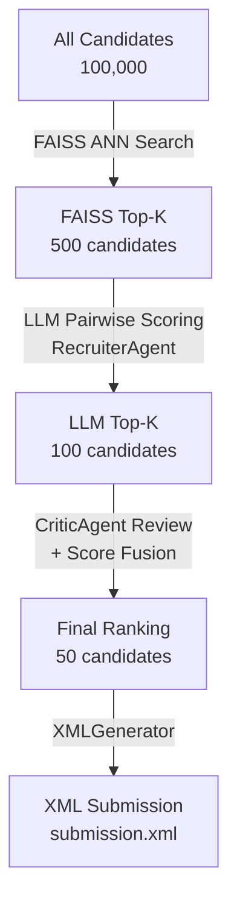
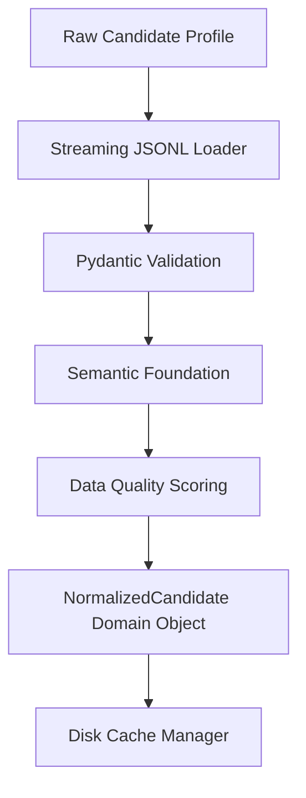

# Architecture — India Runs AI Recruiter

## System Overview

The India Runs AI Recruiter is a multi-agent, LLM-powered candidate ranking
system built for the Redrob "India Runs Data & AI Challenge". Given a job
description and a pool of 100,000 candidate profiles (each containing
résumé data and Redrob platform engagement signals), the system applies a
cost-optimisation funnel — FAISS vector retrieval → LLM pairwise evaluation
→ critic review — to produce a top-50 ranked XML submission. All agents are
independent Python classes with typed interfaces, enabling parallel
development and isolated testing.

---

## Agent Responsibilities

| Agent | Phase | Responsibility | Input | Output |
|---|---|---|---|---|
| **JDAnalystAgent** | 2 | Parse and structure raw job description text into a normalised requirements dict | `raw_jd: str` | `dict` with required_skills, seniority, experience band |
| **CandidateAnalystAgent** | 2 | Assess individual candidate profiles against structured job requirements | `profile: dict` | `dict` with skill_match_score, experience_gap, assessment |
| **BehaviourAnalystAgent** | 2 | Convert Redrob platform signals into a composite behaviour score (0–1) | `signals: dict` | `float` behaviour score |
| **RetrievalAgent** | 2 | Query FAISS index with JD embedding to retrieve top-K similar candidates | `query_embedding: list[float]`, `top_k: int` | `list[dict]` of candidates sorted by similarity |
| **RecruiterAgent** | 3 | LLM pairwise evaluation of candidate vs. job; produces fit score + reasoning | `job: dict`, `candidate: dict` | `dict` with fit_score, reasoning, strengths, gaps |
| **CriticAgent** | 3 | Review initial ranking for bias, edge cases, and consistency; refine order | `ranking: list[dict]` | Refined `list[dict]` with adjusted ranks |
| **RankingAgent** | 3 | Fuse semantic + behaviour scores into a final sorted ranking | `candidates: list[dict]` | `list[dict]` with `rank` field added (1-indexed) |

---

## Cost Optimisation Funnel

The funnel progressively narrows the candidate pool to control LLM API costs:

---

## Data Flow

1. **Input** — `candidates.jsonl` (100K JSONL records) and `job_description.docx`
2. **Parsing** — `JDParser` normalises the raw job description; candidate JSONL is read with pandas/streaming
3. **Embedding** — `Encoder` encodes the cleaned JD text and all résumé texts into dense vectors via `sentence-transformers/all-MiniLM-L6-v2`
4. **FAISS Retrieval** — `FAISSStore` runs approximate-nearest-neighbour search; returns top-500 candidate IDs
5. **Behaviour Scoring** — `BehaviourAnalystAgent` converts Redrob platform signals to a float score for each retrieved candidate
6. **LLM Ranking** — `RecruiterAgent` calls the Google Gemini API (via ADK) to evaluate each of the 500 candidates against the JD; outputs are filtered to top-100
7. **Critic Review** — `CriticAgent` reviews the top-100 for consistency and re-ranks if necessary
8. **Score Fusion** — `RankingAgent` combines semantic (FAISS cosine) and behaviour scores using a weighted formula; selects final top-50
9. **Explainability** — `Explainer` generates one-paragraph justifications per candidate
10. **XML Output** — `XMLGenerator` / `XMLSubmission.to_xml()` serialises the final list to `output/submission.xml`

## Data Foundation Layer (Phase 1.5)

The Data Foundation layer provides a deterministic streaming pipeline for ingestion, validation, normalization, and caching before any AI reasoning occurs.

### Normalization Pipeline

Normalization is configuration-driven using YAML files (`skills.yaml`, `aliases.yaml`, `titles.yaml`, `industries.yaml`). This avoids hardcoded mappings in source files.

### Repositories and Profiling

- **Repositories:** Abstract file access and return streams of `Iterator[CandidateProfile]`. Never loads datasets entirely in memory.
- **CacheManager:** Automatically maintains subdirectories, tracking metadata (`dataset_hash`, `schema_version`) and invaliding stale caches on version changes.
- **Profiling:** `CandidateProfiler` tracks missing values, skill frequencies, and malformed records, outputting a `dataset_profile.json` report to guide AI adjustments.

## Retrieval Layer (Phase 2)

The Retrieval layer implements semantic search using `sentence-transformers` and `faiss-cpu`. It operates strictly on embeddings without involving LLM analysis (which is deferred to Phase 3).

### Split Retrieval Responsibilities

To maintain modularity and single responsibility, the retrieval layer is split into four core components:
1. **VectorIndex (`backend/retrieval/index.py`)**: A wrapper around `faiss.IndexFlatIP` to handle normalized L2 adding and cosine similarity searching.
2. **MetadataStore (`backend/retrieval/metadata_store.py`)**: Maps integer FAISS IDs to string candidate IDs, preserving the connection between the vector space and the dataset.
3. **RetrievalBuilder (`backend/retrieval/builder.py`)**: Consumes the streaming data pipeline to encode normalized candidates in batches and build the index efficiently.
4. **SemanticSearcher (`backend/retrieval/searcher.py`)**: The high-level querying API used by the `RetrievalAgent`.

### Embedding Configuration

The embedding models and caching strategy are defined in `configs/embedding.yaml`, allowing seamless swapping of `EmbeddingProvider` implementations in the future.

---

## Phase Roadmap

| Phase | Name | Description | Status |
|---|---|---|---|
| **1** | Foundation | Project scaffold, schemas, FastAPI stub, tests, docs | ✅ Complete |
| **2** | Retrieval | FAISS index build, embeddings, behaviour scoring, pipeline wiring | 🔜 Planned |
| **3** | LLM Ranking | RecruiterAgent + CriticAgent with Google ADK / Gemini | 🔜 Planned |
| **4** | Optimisation | Batch API calls, caching, async pipeline, cost tracking | 🔜 Planned |
| **5** | Submission | Validation, XML generation, leaderboard submission | 🔜 Planned |
